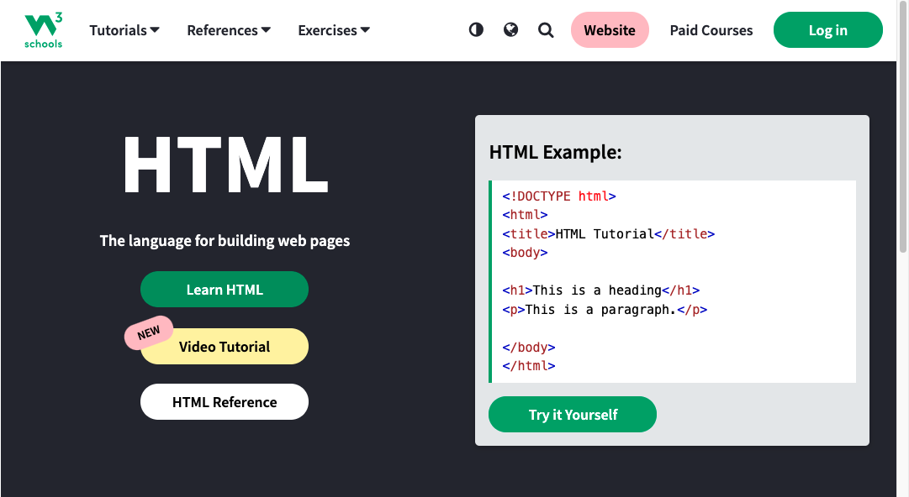

**안녕하세요!** **티케이**의 개발 일지 입니다!!

공부를 하면서 노트필기 하는 스타일로 작성하는거라 도움이 될 지 모르겠지만,... ㅠㅠ

그래도 열심히 작성해볼테니! 도움이 되었으면 좋겠습니다!! 


`그럼 시작!!`

<br>
<br>
<br>

# 추천사이트
## **1. w3scools**


링크 [w3school](https://www.w3schools.com/)

**w3schools**는 온라인으로 웹 기술을 배우는 교육용 웹 사이트이다. 다양한 예제와 따라하기, Quiz 등을 통해 공부 할 수 있다.

~~하지만.. 나는 어려운걸....ㅠ~~

<br>

## **2. developer.mozilla**


링크 [developer.mozilla](https://developer.mozilla.org)

**mozilla**는 정말 유용한 사이트이다. 각종 태그들의 사용방법, 예시 등 아주 자세히 나와있고, 나 같이 영어 울렁증 있는 사람들도 쓸 수 있게 **한글**이 있다!!!!!

이건 저도 **즐찾**하고 사용하고 있어욤

---

자 이제 HTML의 기본 태그에 대해서 알아볼게요~
저 같은 초보한테는 

<br>

### ~~**_'흰건 배경이고, 꺼먼건 글씨인건 알겠는데...'_**~~

<br>

하지만 하다보면 언젠가는 익숙해지겠죠 ㅋㅋ


<br>

# **HTML 기본 태그**

## **h1 ~ h6**

```html
<h1><h1> <!--이건 큰 제목 -->
<h2><h2> <!--이건 조금 작은 제목 -->
<h3><h3> <!--이건 조금 더 작은 제목 -->
<h4><h4> <!--이건 조금 더더 작은 제목 -->
<h5><h5> <!--이건 아주 작은 제목 -->
<h6><h6> <!--이건 아~주 작은 제목 -->
```
- 번호별로 크기가 달라짐(높을수록 하위 제목)
- 줄바꿈 적용(줄이 넓게 띄어짐)

>### 권장사항
>- h1은 페이지당 하나만 쓰기
>- 순서 건너뛰지 말기
>- 시각적인 효과로 사용하지 않기(시각적인 효과는 CSS에서!)
>- 정보의 구조를 나타내는 용도로만 사용하기

<br>
<br>

## **줄바꿈 태그**

```html
<br> <!-- 줄 바꿀때 쓰자-->
```

- break r(?)ine 이라고 생각하면 이해가 됩다
- 닫는 태그 필요 없고 위치도 무관!
- 여러번 사용 = 여러 줄 띄우기
- 단순 시각적인 줄 바꿈(엔터랑 일맥상통)

<br>
<br>

## **Pragraph**

```html
<p>
  동해물과 백두산이 마르고 닳도록
  하느님이 보우하사 우리 나라 만세
</p>
```

- 정보 부여: 한 문단, 정보 덩어리임
- CSS가 적용 될 단위로 사용
- 단순 줄 바꿈이 아닌, 문단 구분을 위함

<br>
<br>

## **강조 태그**

```html
<b></b>           
<strong></strong> 
```

- 볼드체는 단순 볼드체, 대단한 기능 없음
- **하지만 스트롱은 다르다. 컴퓨터에서 중요한 정보임을 알려줄때 사용**
- 단순 bold 랑 strong은 **어마어마한 차이가 있다**.

<br>
<br>

## **기울임 태그**

```html
<l></l>
<em></em>
```

- 위에 강조 태그랑 흡사
- l 은 단순 기울림 태그지만
- em 은 정보적 강조를 한다.

<br>
<br>

자 여기까지 html 기본태그 1에 대해서 알아보았다.

내가 썼지만.. 대충 이해가 되는거 같은데

여기서 중요하다고 생각드는 부분은
          
    " <b> 태그와 <strong> 태그는 같은 느낌이지만
    기능적으로 다르다

또한

    " <l> 태그와 <em> 태그도 같은 느낌이지만
    기능적으로 다르다

가 **포인트!!!!**

<br>
<br>

오늘은 여기까지